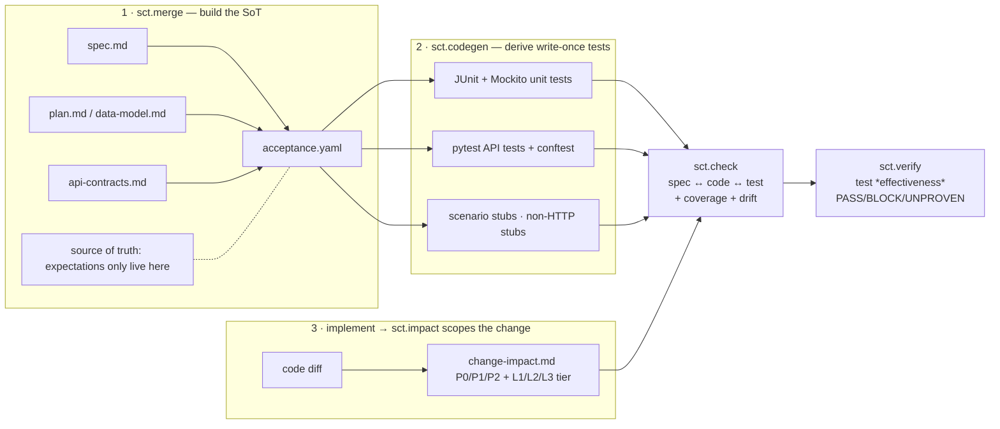

# SCT — Spec-Code-Test Consistency (Speckit Extension)

A [Spec Kit](https://github.com/github/spec-kit) extension that implements the
**SCT methodology**: keep a single source of truth, derive tests from it, and
gate every change on a three-way consistency check — so quality is *built in*
by the forward chain (spec → code → test), not patched on afterward.

> 中文简介：SCT 是一套 spec→code→test→check→verify 的前向保证链方法论——
> 唯一的期望来源是 `acceptance.yaml`（SoT），测试由它机械派生（write-once），
> 每次变更用三方一致性 + 覆盖率 + 测试有效性门禁确认前向链路没有断。
> 面向内网/离线环境设计：确定性脚本优先，模型只辅助、不作判决。

## Methodology

SCT (Spec-Code-Test Consistency) is a methodology, not just a command set. This
section explains the *why* — the problem it targets, the principles that keep
the pipeline honest, and the anti-patterns it is built to catch.

### 1. The problem: three truths drift apart

In spec-driven development, three artifacts claim to describe the same change —
and they silently diverge:

| Artifact | Drifts when |
|---|---|
| **spec.md / plan.md** | the requirement changes but nobody updates the doc |
| **code** | the implementer interprets the requirement differently, or takes shortcuts |
| **tests** | someone "fixes" a failing test to match the code instead of the requirement |

Left alone, the divergence compounds: the tests turn green while the spec and the
code disagree, and nobody notices until the bug reaches production. SCT treats
this as the **central risk** and attacks it with a *forward* chain that makes
divergence loud and cheap.

### 2. One source of truth — the SoT

SCT collapses the sources into a single machine-readable contract:
**`acceptance.yaml`** (the *SoT* — Single source of Truth), merged from
`spec.md` / `plan.md` / `data-model.md` / `api-contracts.md` by `sct.merge`.

The SoT is the **only place where expectations live**: business rules
(`rules[].text`), their inputs and expected outcomes (`test_cases`), API
contracts (`apis[]`), acceptance journeys (`acceptance_scenarios`), and
non-HTTP contracts (`non_http_interfaces`). Everything downstream reads from it
and never writes back.



### 3. The forward guarantee chain

SCT's core idea: **quality is built in by the forward chain (spec → code →
test), not patched on afterward.** Compare the two flows:

| | Patch-on (传统流程病) | Forward chain (SCT) |
|---|---|---|
| Tests appear | hand-written after the code, "to cover" it | **derived from the SoT**, mechanically |
| When code & spec disagree | tests are adjusted to stay green | the divergence **fails loudly** |
| Who judges | whoever wrote the test (biased) | the SoT (the agreed truth) |
| Cost of drift | discovered late, expensive | surfaced at every change, cheap |

Each command confirms the previous link *before* the chain moves on; the SoT is
never silently amended to excuse a failing test.

### 4. Derived tests are write-once — and assertions never come from code

`codegen` derives tests from the SoT. Input *values* come from
`test_cases.inputs`; the *shape* (parameter types / order) comes from the public
signature — **read at generation time, not reverse-engineered from the method
body**. Assertions / expected exceptions come exclusively from
`test_cases.expect`.

> 反推断言 = 自己出题自己改卷 (setting the exam and grading it yourself).
> If the assertion were inferred from the code, the code's mistakes would be
> *legalized* by the test. SCT never lets CodeGraph — or the LLM — infer an
> expectation; it only helps *construct the request*.

Tests are **write-once**: to change behaviour, change the SoT and regenerate.
Hand-editing a generated test is a workflow violation, because a hand-edited
test has silently stopped representing the SoT.

### 5. Drift is a signal, not a verdict

When the SoT and the code disagree, SCT classifies *which link broke* instead of
showing a confusing wall of red:

| Drift | Broken link | Fix direction |
|---|---|---|
| `MISSING_IMPL` | Spec → Code | implement what the SoT declares |
| `MISSING_TEST` | Code → Test derivation | run `sct.codegen` (never hand-write to silence) |
| `UNSPEC_API` | SoT registration gap | register the API in the SoT |
| `MISSING_RULE_TEST` | rule without test evidence | add `checks` / `target+test_cases` |
| `FIELD_DRIFT` | SoT DTO ↔ code DTO | reconcile which field is right |
| `BINDING_DRIFT` | SoT ↔ public contract | rename / regenerate after SoT fix |
| `MISSING_INTENT` | test without truth intent | regenerate intent-carrying tests |
| `MISSING_NON_HTTP_IMPL` | non-HTTP contract unregistered | implement the listener/scheduler |

The 8-type taxonomy turns "tests are red" into "this specific link broke — fix
it there", and the failing test itself stays the alarm, not the verdict.

### 6. check is a confirmation gate, not a rescue net

`sct.check` runs the tests, compares spec ↔ code ↔ test three ways, applies the
coverage gate, and writes a human-review report. The gate is:

- SoT-scope coverage **100%** (every registered rule / API / scenario has a test)
- incremental line coverage **≥ 80%** (JaCoCo), when `--jacoco` is given
- **zero HIGH drifts**

A pipeline that *relies* on `check` to catch what the forward chain should have
prevented is a process disease, not a working loop — `check` confirms the chain,
it does not rescue it.

### 7. The tier gate: spend AI tokens by risk

`sct.impact` reverse-traces the change and classifies it L1 / L2 / L3 so the
pipeline never spends full cost on a typo:

| Tier | Typical change | Pipeline |
|---|---|---|
| **L1 小改** | ≤ 2 files, no contract change | impact only → existing regression |
| **L2 中改** | API contract / rule change, ≤ 5 APIs | codegen (targeted) + check (full report) |
| **L3 大改** | new feature / multi-module / migration | full SOP + e2e + verify |

Duration / token control is a first-class concern: hash-cached regeneration
(no-op when SoT + CodeGraph are unchanged), `--only` targeted regeneration, and
`L1` produces no downstream artifacts at all.

### 8. Test existence ≠ test effectiveness (`sct.verify`)

`sct.check` proves "tests exist and cover the SoT". It cannot prove the harder
claim: **these tests would actually fail if the code were broken.** `sct.verify`
closes that gap with an honest three-state gate:

| Check | Catches |
|---|---|
| `PHANTOM_TASK` | tasks.md says `[X]` but no class/method evidence exists in code — *claimed done, not done* |
| `COMPILE` | generated tests were never compiled |
| `REAL_TESTS` | the report shows **0 actually executed** tests |
| `MUTATION` | injected defects don't turn the tests red (score < threshold) |

Its output is deliberately not a binary pass/fail:

- **PASS** — the tests compile, really run, and (when enabled) kill mutants.
- **BLOCK** — a phantom / compile failure / zero execution / weak mutation.
- **UNPROVEN** — cannot be verified (no Maven, no surefire reports, no tasks.md).
  **UNPROVEN is not PASS** — an unverified claim must not masquerade as a green.

### 9. Where SCT sits vs. related practices

| Practice | Timing | Question it answers | SCT relation |
|---|---|---|---|
| **TDD** | red → green before code | "does the new code satisfy the test?" | complementary; SCT is *post*-implementation by default (brownfield-friendly) and can run `test_timing: pre` |
| **BDD** | scenario authoring | "is the behaviour expressed in a shared language?" | SCT keeps G/W/T in the SoT and bridges them to Playwright (`sct.e2e`) |
| **test coverage tools** | after tests run | "what lines were touched?" | SCT *uses* JaCoCo for the 80% gate, then asks the stronger question with `sct.verify` |
| **LLM-driven review** | after code | "does the code look compliant?" | SCT prefers *deterministic* derivation from the SoT — the LLM assists, never verdicts |

The deterministic-script-first stance is deliberate: SCT is designed to run on
an **air-gapped intranet with a weak offline model**, where a chain that depends
on LLM judgement for every check would be slow, costly and unreliable.

### 10. Anti-patterns SCT is built to catch

- ❌ Silently editing a generated test green — the alarm is not the verdict.
- ❌ Writing the assertion by reading the code — self-grading exams.
- ❌ `coverage = len(scenarios)` — a report that cannot lie about coverage.
- ❌ Claiming `[X]` without implementation — phantom tasks.
- ❌ Saying "verified" without having verified — **UNPROVEN ≠ PASS**.
- ❌ Letting `check` become the rescue net for a broken forward chain.

## What it provides

6 commands — non-intrusive (zero hooks, original flow untouched):

| Command | Purpose | Key artifact |
|---------|---------|--------------|
| `speckit.sct.merge` | Build `acceptance.yaml` (SoT) from spec / plan / data-model / api-contracts | `acceptance.yaml` |
| `speckit.sct.codegen` | Derive unit + e2e tests from the SoT (write-once) | `tests/generated/*` |
| `speckit.sct.check` | Three-way consistency check spec ↔ code ↔ test + human-review report | `test-report.md` |
| `speckit.sct.impact` | Reverse-trace code changes → affected scenarios (P0/P1/P2) + L1/L2/L3 tier | `change-impact.md` |
| `speckit.sct.e2e` | Bridge impact + SoT into Playwright auto-regression | `e2e/auto_generated/*` |
| `speckit.sct.verify` | Test-effectiveness gate: phantom tasks, real compile, real executed tests, mutation score (PASS/BLOCK/UNPROVEN) | `verification.md` |

**Non-intrusive by design.** SCT registers **no lifecycle hooks** and never
alters the original `specify / plan / implement / constitution` flow. The 6
commands above are invoked **manually by the user**, after implementation — the
user decides, per change, whether and when to run `merge` / `codegen` / `check`
/ `impact` / `e2e` / `verify`.

## Installation

### Extension (commands + scripts)

Install the released extension from its GitHub archive:

```bash
specify extension add sct --from https://github.com/zqianqian137/spec-kit-sct/archive/refs/tags/v1.1.2.zip
```

Or install from a local checkout during development:

```bash
specify extension add --dev /path/to/spec-kit-sct
```

> 已指向真实仓库 `zqianqian137/spec-kit-sct`。catalog 的 `documentation` /
> `download_url` / `homepage` 均指向该仓库，发布时无需再替换。

## When to use it

- You want spec, code, and tests to stay consistent automatically as the project evolves.
- You run brownfield / incremental work and only want to test what actually changed.
- You want AI-assisted SoT extraction and semantic drift detection (`--ai` flags).

## When NOT to use it

- You want the original Speckit flow to stay untouched AND want light
  overrides — install the extension only and manually run `sct.*` per change;
  there is no auto-attach preset in this release.
- You expect SCT to auto-run inside your `plan`/`implement` flow — it does not;
  the 6 commands are manual by design, so you must invoke them yourself after
  implementation.

## Quick start

```bash
# 1. Build the single source of truth from your spec artifacts
specify sct.merge --spec specs/001/spec.md --out specs/001/acceptance.yaml

# 2. Derive write-once tests
specify sct.codegen --spec specs/001/acceptance.yaml --out tests/generated

# 3. After implementation, run these manually (nothing auto-fires):
specify sct.impact            # optional: reverse-trace the change first
specify sct.check --spec specs/001/acceptance.yaml --code backend/src/main/java --tests tests/generated

# 4. Reverse-trace a change and (optionally) generate e2e regression
specify sct.impact
specify sct.e2e

# 5. L2/L3: verify the tests actually catch bugs (honest three-state gate)
specify sct.verify --spec specs/001/acceptance.yaml --code backend/src/main/java \
  --tasks specs/001/tasks.md --surefire backend/target/surefire-reports
```

The `--ai` flag on `merge` and `check` requires `SILICONFLOW_API_KEY`
(optional). When the `codebase-memory-mcp` connector is connected, `sct.impact`
enriches the reverse trace via semantic code search (otherwise it falls back to
a ripgrep static scan).

## Making rule tests truly executable (no more empty skeletons)

`test_rules.py` is generated as an **offline static assertion** — it verifies that
every business rule registered in the SoT has a corresponding piece of evidence in
the code (annotation / method / exception / constant), without starting any service.
To make a rule's assertion precise, add a `checks` list to the rule in your SoT
(`acceptance.yaml` or an `--api-contracts` YAML):

```yaml
rules:
  - id: BR-001
    text: 单次导入不超过 1000 条用例
    priority: P0
    checks:
      - kind: annotation          # 在代码中应出现该注解
        target: BatchImportRequest # 可选：限定文件名/类名以缩小扫描范围
        expect: "@Max(1000)"
      - kind: exception           # 应抛出该异常类
        expect: "BatchSizeExceededException"
```

`kind` may be `annotation` / `method` / `exception` / `constant` / `text`.
`codegen` receives the code root via `--code` (default `backend/src/main/java`);
you can also override at runtime with env `SCT_CODE_ROOT`.

If a rule has **no `checks`**, codegen falls back to a best-effort loose text match;
if that still finds nothing, the test **fails clearly** (telling you to add `checks`)
instead of being silently skipped. Acceptance scenarios are end-to-end journeys and
are validated at the API / E2E layers, so `test_scenarios.py` fails with a clear
pointer rather than a false green.

## Java unit tests — AAA pattern, signature-bound, SoT-anchored

`speckit.sct.codegen` generates **executable JUnit unit tests** for business rules
that carry `target` + `test_cases` in the SoT. Generated tests follow the classic
**AAA** structure with a `@DisplayName` intent annotation (JUnit 5):

```java
@Test
@DisplayName("BR-001: VIP3 会员购买 100 元商品应返回 85 元折后价 | 输入 originalPrice=100.0, vipLevel=3 时应返回 85.0")
void testCalculateDiscountPrice_WithVip3_ShouldReturn85() throws Exception {
    // 1. Arrange (准备/输入)
    double originalPrice = 100.0d;
    int vipLevel = 3;
    double expectedResult = 85.0;            // 预期结果来自 SoT
    // 2. Act (执行)
    Object actual = service.calculateDiscountPrice(originalPrice, vipLevel);  // JDK8 兼容：不写 var(Java10+)
    // 3. Assert (断言)
    assertEquals(expectedResult, actual, "BR-001: ... 返回值与预期不符");
}
```

How the three JUnit parts are sourced — so the test is **not biased by the code**:

- **Inputs (values)** come from `test_cases.inputs` in the SoT.
- **Inputs (shape)** — parameter types / order — come from the **public signature**
  of the target method, parsed at generation time when `--code` is passed. The
  generator binds SoT inputs to parameters by name (else position) and auto-detects
  collaborators (constructor params + injected fields) to `@Mock` them — Spring is
  **never** used (`@ExtendWith(MockitoExtension.class)` on JUnit 5,
  `@RunWith(MockitoJUnitRunner.class)` on JUnit 4). It reads the signature, not the
  method body, so it cannot reverse-engineer the assertion.
- **Assertions / exceptions** come from `test_cases.expect` (SoT), never from the code.

**Mock stubs are SoT-anchored too.** When a rule depends on a collaborator, add a
`given` list so the generator emits `when(...).thenReturn(...)` in Arrange; without it
the test would silently fail on the mock's default value:

```yaml
test_cases:
  - name: testTotal_ShouldReturnRepoCount
    inputs: {}
    given:
      - call: batchRepository.count()   # stub the collaborator (Arrange)
        returns: 5
    expect: { returns: 5 }
```

**Divergence is a signal, not a verdict.** When the SoT and the code disagree, the
generator emits a `BINDING_DRIFT` entry (also written to `_codegen_meta.json` and the
coverage report) instead of a confusing red:

- `METHOD_NOT_FOUND` — the SoT target method was renamed / removed in code.
- `MISSING_INPUT` — a parameter has no value in `test_cases.inputs`.
- `UNCONSTRUCTABLE_ARG` — a complex object / object list can't be auto-built (e.g.
  `List<Case>`); the arg is set to `null` and the test fails honestly so a human fills
  a `call` or a constructible value.
- `MOCK_NOT_STUBBED` — a collaborator is mocked but no `given` stub was provided.

When a generated test fails, **never silently edit it green**. Escalate to a human:
code is wrong → fix the code; SoT / test is wrong → fix the SoT and regenerate. Both
fixes must trace back to the requirement — the test is the alarm, not the verdict.

> Generated `.java` files may carry **Chinese** `@DisplayName` / comments. Compile with
> UTF-8: `javac -encoding UTF-8 ...`, or set `project.build.sourceEncoding=UTF-8` in
> Maven. JUnit 5 is preferred; if the project already uses JUnit 4, codegen follows 4
> (the two are never mixed).

## Notes

- Tests are **write-once**: change the SoT, then regenerate — do not hand-edit
  generated tests.
- Brownfield incremental mode: set `_meta.coverage_mode: incremental` in the
  SoT, or pass `--mode incremental` to `sct.check`.
- A `codegraph.json` (schema in `templates/codegraph-template.json`) upgrades
  generated API tests from skeleton to near-executable (real examples, required
  fields, field-level `FIELD_DRIFT`); without it, pure-SoT generation is used.

## License

[MIT](LICENSE)
